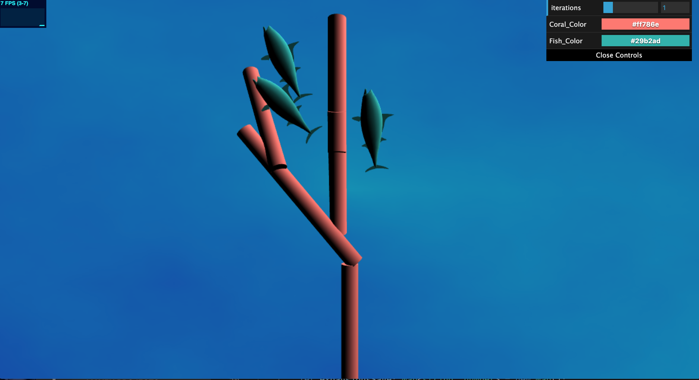
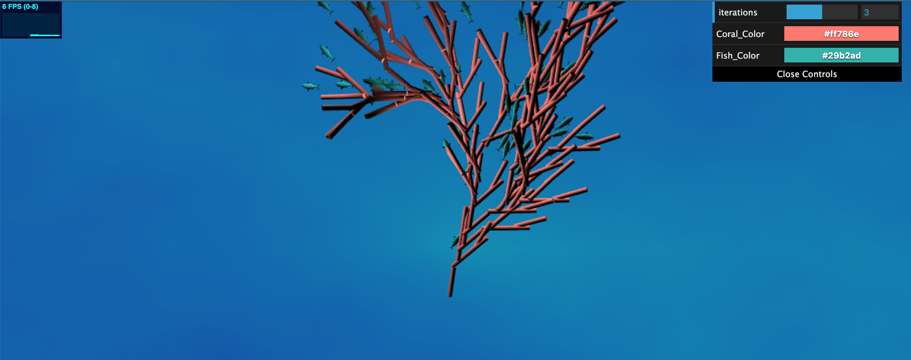

# Homework 4: L-systems
## Catherine Yang, PennKey: catyang

## https://catyang97.github.io/hw04-l-systems/

## Coral Reef- 1 Iteration + Fish Closeup

## Coral Reef- 3 Iterations
(Zoom out to see)

---
## References
- Spongebob Announcer Fish Model: https://www.models-resource.com/gamecube/spongebobsquarepantslightscamerapants/model/6096/
- Vecs, Mats, Quat Functions: http://glmatrix.net/docs/index.html
- CIS 566 Slides: https://cis700-procedural-graphics.github.io/files/lsystems_1_31_17.pdf
- Quat and rotation information: CIS 562 Material

---
## Inspiration
Fan Coral Reefs

---
## Implementation
- LSystem Class: The LSystem class keep track of the current turtle, the turtle history, map of expansion rules, map of drawing rules, and the stack of transformation matrices for the turtles and the fish. In each iteration, the grammar is expanded in the L-System, and this class draws the grammar using the written drawing rules.
- Turtle Class: The Turtle keeps track of its orientation and position. The orientation is represented with a quat and a global up vector. The position is adjusted by moving along the direction/orientation of the turtle. This class also outputs the turtle's transformation in the form of a matrix, as well as a fish's transformation.
- ExpansionRule Class: Each ExpansionRule holds the string that we are expanding and a map of possible expanded strings along with their probability of being chosen.
- DrawingRule Class: Each DrawingRule holds the string that we are drawing and a map of possible functions that might be called for each rule along with their probability of being chosen.
- Background: I used a noise function to color the ocean.
- Instance Rendering: A collection of transformation and color data is passsed to the GPU to draw the L-System objects using instanced rendering.